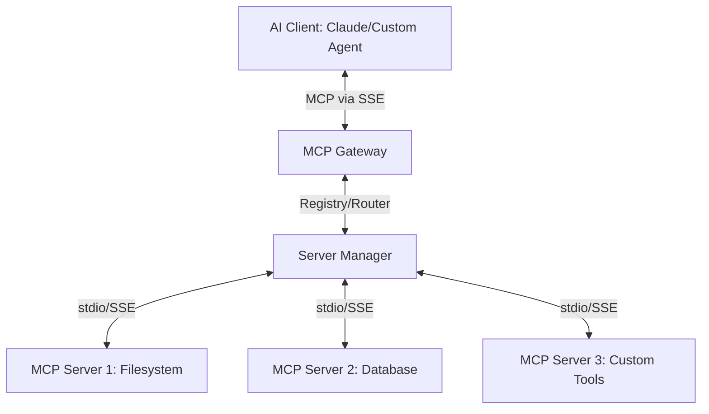

# MCP Gateway Implementation Plan

The goal is to build a robust, scalable Gateway for the Model Context Protocol (MCP). This gateway will aggregate multiple MCP servers (upstream) and present them as a single MCP server to clients (downstream), adding layers for security, monitoring, and orchestration.

## Architecture Overview

## Proposed Features

1.  **Server Aggregation**: Connect multiple MCP servers (both `stdio` and `sse` transports).
2.  **Unified Schema**: Automatically merge tools, resources, and prompts from all connected servers.
3.  **Dynamic Routing**: Intelligently forward requests to the correct upstream server based on the tool/resource name.
4.  **Security Layer**: API Key authentication for clients.
5.  **Observability**: Logging of all tool calls and resource accesses for auditing.
6.  **Hot Reloading**: Ability to add/remove upstream servers without restarting the gateway (future phase).

## Technology Stack

- **Runtime**: Node.js (Latest LTS)
- **Language**: TypeScript
- **Backend Framework**: Fastify (Performance & Schema validation)
- **MCP Core**: `@modelcontextprotocol/sdk`
- **Configuration**: YAML or JSON based config for upstream servers.

## Proposed Implementation Phases

### Phase 1: Project Setup & Core Infrastructure
- Initialize TypeScript project.
- Implement the basic Fastify server with SSE support.
- Define the configuration schema for upstream servers.

### Phase 2: Upstream Connection Manager
- Implement logic to spawn and manage `stdio` based MCP servers.
- Implement logic to connect to remote `sse` based MCP servers.
- Handle lifecycle (start/stop/restart) of upstream connections.

### Phase 3: Aggregator & Router
- Build a unified registry of tools, resources, and prompts.
- Implement the `list_tools`, `list_resources`, and `list_prompts` handlers that aggregate data.
- Implement the `call_tool` and `read_resource` dispatchers.

### Phase 4: Security & Polish
- Add Middleware for Authentication.
- Implement structured logging (Pino).
- Create a basic CLI to start the gateway.

## Verification Plan

### Automated Tests
- Unit tests for the Router logic.
- Integration tests using mock MCP servers.

### Manual Verification
- Connect the Gateway to Claude Desktop.
- Connect multiple sample MCP servers (e.g., `everything`, `filesystem`) and verify they all appear in the client.
